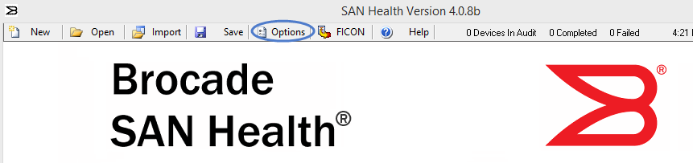
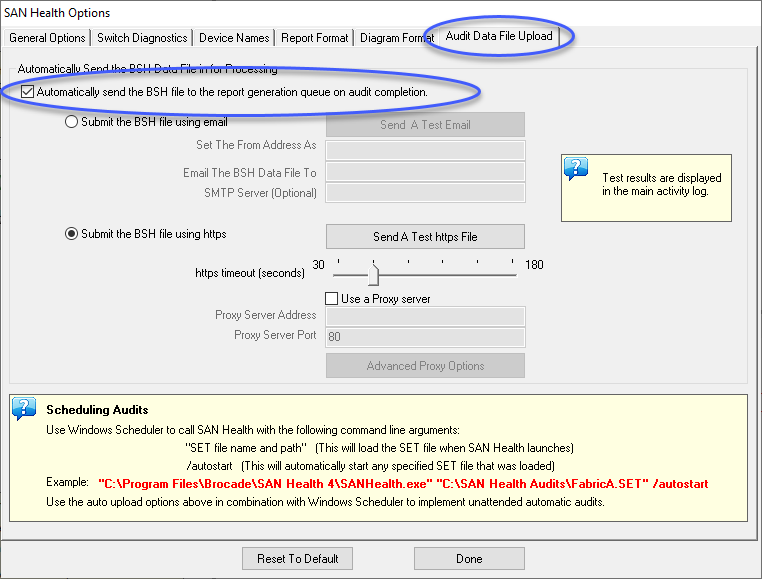

# Brocade SAN
## Documentation Links
### Support Information
- [Broadcom Support Portal](https://support.broadcom.com)

### Reference Guides
- [Brocade FOS Administration Guide, 9.0.x](https://docs.broadcom.com/doc/FOS-90x-Admin-AG)
- [Brocade FOS Command Reference Manual, 9.0.x](https://docs.broadcom.com/doc/FOS-90x-Command-RM)

### Microcode Guidance
- [Download Microcode from IBM Fix Central](https://www.ibm.com/support/fixcentral)

## Implementation
### Implementation Checklist

These are the typical items that should be reviewed and/or configured when setting up a new Brocade SAN switch/director. While many of these settings can be set in WebTools, the CLI commands are listed here for a simlper checklist.

#### User Settings

- <input type="checkbox"/> Enable root access *optional*

```
userconfig --change root -e yes ; rootaccess --set all
```

- <input type="checkbox"/> Set root password to pre-defined password (Login as root/fibranne and it will prompt you to change)

- <input type="checkbox"/> Set admin password to pre-defined password

```plaintext
passwd
```

#### Name and Address

- <input type="checkbox"/> Set the switch name

```plaintext
switchname new_name
```

- <input type="checkbox"/> Set IP address, subnet mask, gateway

```plaintext
ipaddrset
```

- <input type="checkbox"/> Set the Registered Organization Name **(Directors Only)**

```
ron --set <customer_name>
```

#### Data Center Settings

- <input type="checkbox"/> Verify Management Port Speed (Default is 1000-auto, but some customers need this set to 100-full)

```plaintext

## If 100-full is required
ethif --set eth0 -an off -speed 100 -duplex full

## Validate
ethif --show eth0
```

- <input type="checkbox"/> Configure timezone

```plaintext
tstimezone America/Chicago
```

- <input type="checkbox"/> Reboot to make new timezone effective (do this before configurating the clock)
```
reboot
```

- <input type="checkbox"/> Configure clock

```plaintext
date mmddHHMMyy
```

- <input type="checkbox"/> Configure DNS

```plaintext
dnsconfig --add -domain <domain_name> -serverip1 <ip_address_1> -serverip2 <ip_address_2>
```

- <input type="checkbox"/> Configure NTP server

```plaintext
tsclockserver "ntp_server_name"
```
- <input type="checkbox"/> Configure SMTP server

```plaintext
relayConfig --config -rla_ip <relay IP> -rla_dname <domain name>
```

- <input type="checkbox"/> [Configure LDAP](/san/brocade/ldap-switch) (optional)

#### Licenses

- <input type="checkbox"/> [Apply new licenses](/san/brocade/license) (POD, etc.)

- <input type="checkbox"/> Verify licenses (POD, etc.)

```plaintext
licenseshow
```

- <input type="checkbox"/> [Assign static port licenses](/san/brocade/license#static-port-assignment)


#### Firmware
- <input type="checkbox"/> Update FOS
```plaintext
firmwaredownload <ftp_server_ip>,<ftp_userid>,<path_to_firmware>
```
- <input type="checkbox"/> Configure domain id and set insistent domain ID

```plaintext
switchdisable ; configure
```

#### Zone Config

- <input type="checkbox"/> Configure default zone policy to No Access

```plaintext
defzone --noaccess ; cfgsave
```

- <input type="checkbox"/> Configure zoning

#### Optional
- <input type="checkbox"/> Persistent disable all ports
```
portcfgpersistentdisable 3/0-47
portcfgpersistentdisable 4/0-47
portcfgpersistentdisable 5/0-47
portcfgpersistentdisable 6/0-47
portcfgpersistentdisable 9/0-47
portcfgpersistentdisable 10/0-47
portcfgpersistentdisable 11/0-47
portcfgpersistentdisable 12/0-47
```

#### MAPS
- <input type="checkbox"/> Enable a policy
```
mapspolicy --show -summary
mapspolicy --enable dflt_conservative_policy
```
- <input type="checkbox"/> Verify policy is active
```
mapsconfig --show
mapsconfig --actions raslog,email
mapsConfig --emailcfg -address rick.k@evolvingsol.com
mapsconfig --show
mapsconfig --testmail -subject "this is a test" -message "test email body"
```
## FCIP Configuration
### Circuit Requirements
The following requirements and limitations are applicable for extension circuits:
- Each circuit has a unique pair of source and destination IP addresses.
- An IP interface (IPIF) defines an IP address associated with a circuit endpoint and GE interface.
- The maximum rate of a circuit cannot exceed the GE interface speed.
- On a GE interface, defining multiple IPIFs allows multiple circuits on that interface.
- A VE_Port with multiple circuits is a Brocade Extension Trunk (BET).
- If the source and destination IP addresses of a circuit are not on the same subnet, an IP route must be configured on both ends.
- Metric-0 circuits are active under normal operating conditions within the failover group.
- Metric-1 circuits are active when all metric-0 circuits within the failover group have gone offline.
- A failover group control which metric-1 circuits become active when metric-0 circuits in the group go offline.
- When a spillover is configured, failover groups are not used.
- When a spillover is configured, metric-1 circuits are used when the capacity of the metric-0 circuit is exceeded.
- 4:1 Rule: Within a tunnel, consider the ARL minimum rates, the difference between the slowest min rate and the fastest min rate can be no greater than 4x.
    - For example, minimum rates are Cir0=1Gb/s and Cir1=4Gb/s is supported; however, Cir0=1Gb/s and Cir1=5Gb/s is not.
    - If circuits are configured with rates greater than 4x apart, entire bandwidth of the BET might not be fully utilized.
- Minimum supported bandwidth as follows:
    - Brocade 7810 Extension Switch is 20Mb/s.
    - Brocade 7850 Extension Switch is 50Mb/s.
    - Brocade SX6 Extension Blade is 20Mb/s.
- Circuit settings should be identical on both ends including minimum and maximum bandwidth values and KATOV. There are some settings that must match on both ends, otherwise the circuit will not function.
### WAN Limits
- The maximum supported RTT of 250 ms @ 1.0% packet loss with a KATOV configuration of 2 seconds or more.
- The RTT of 200 ms @ 0.1% packet loss is supported on all KATOV configurations.
- These limits are the same on all supported platforms.

### Tunnel Rquirements
A Brocade Extension platform has the following tunnel requirements:
- The difference between a minimum and maximum circuit bandwidth of a tunnel cannot exceed a factor of 5:1.
- VE_Ports are not associated with any particular GE interface.
- Tunnel settings must be identical on both ends.
    - If there is a mismatch in IPsec, compression, FastWrite, OSTP, and FICON settings, the tunnel fails to come up.
- Best practice is to not implement multiple VE_Ports between the same domains.
    - With each application having unique requirements, it should be confined to a particular logical fabric, which will have a designated domain of its own. Each logical fabric should have a single tunnel (one VE_Port) with multiple circuits between the two domains.
- VE_Ports cannot connect between the same two domains while E_Ports or EX_Ports are connected in parallel.
    - It is not possible to have simultaneous VE_Ports and E_Ports between the same two domains. For example, Extension FCIP plus native FC over DWDM between the same two switches.

### FCIP Configuration Checklist
- <input type="checkbox"/> Have the Brocade platforms been installed into a rack?
- <input type="checkbox"/> Have the Brocade platforms been connected to a dual power?
- <input type="checkbox"/> Have the Brocade platforms been connected to the Mgmt network?
- <input type="checkbox"/> Have the Brocade platforms been cabled to the storage replication ports?
- <input type="checkbox"/> Have the Brocade platforms been cabled to the IP WAN network?
- <input type="checkbox"/> The Brocade platform has undergone basic configuration for:
    - <input type="checkbox"/> Switch name
    - <input type="checkbox"/> Fabric name
    - <input type="checkbox"/> Support Link
    - <input type="checkbox"/> Domain ID
    - <input type="checkbox"/> AAA (LDAP and RADIUS)
    - <input type="checkbox"/> SSH access
    - <input type="checkbox"/> DNS
    - <input type="checkbox"/> NTP
    - <input type="checkbox"/> IPfilter
    - <input type="checkbox"/> syslog
    - <input type="checkbox"/> default zoning
    - <input type="checkbox"/> Any other security configurations
- <input type="checkbox"/> Has the WAN IP network been provisioned and is the IP network operational from end-to-end?
- <input type="checkbox"/> Specific to each platform, determine the required Application mode, VE Mode, and GE Mode settings?
- <input type="checkbox"/> Determine the amount of bandwidth required to satisfy your replication needs?
- <input type="checkbox"/> Determine the VE_Port you use for the tunnel? *Typically, the first one is used, and the same number on both ends.*
- <input type="checkbox"/> Determine how many circuits that the tunnel needs for aggregate bandwidth and resiliency purposes? *Will additional circuits be needed for failover (metric-0 and metric-1)? Often when using BET, failover circuits are not needed.*
- <input type="checkbox"/> Determine the minimum and maximum bandwidth of each circuit? *If ARL is not being used, setting the minimum = maximum rate disables ARL and enables Committed Information Rate (CIR) at the rate specified*
- <input type="checkbox"/> Determine which GE interfaces will be used for each circuit?
- <input type="checkbox"/> Obtain the IP subnets, subnet masks, and end-to-end network MTU. *Assign IP addresses from the subnets to IPIF of each circuit*
- <input type="checkbox"/> Determine local and remote IP addresses for each circuit?
- <input type="checkbox"/> Determine local and remote eHCL IP addresses for each circuit? *Configuring eHCL is optional and the extension platform must support eHCL.*
- <input type="checkbox"/> If the local and remote subnets are different, L3 network, determine the gateway IP address. Frequently, there is only one gateway; however, there could be different gateways for different remote subnets. *The gateway is on the same subnet as the IP address of the IPIF that uses the gateway. The route also contains the remote subnet and its mask.*

### FCIP Configuration Steps
#### Configure GE Interfaces
1. Enter `portcfgge` command with the `--help` option:
        portcfgge --help
1. Show the GE Interfaces and amke note of speed and WAN or LAN indication.  A flag of **L** means it is set for LAN (don't want this for FCIP).  No **L** indicates it is set for WAN (this is correct).
        portcfgge --show
1. Set the GE port to 10G
        portcfgge ge2 --set -speed 10G
        portcfgge ge3 --set -speed 10G
1. Assign IP addresses to the IP interfaces
        portcfg ipif ge2 create 10.42.148.237/24
        portcfg ipif ge3 create 10.42.148.238/24
1. Show the IP interfaces
        portshow ipif
1. Create FCIP tunnel (Do on both sides)
        portcfg fciptunnel 12 create
        portcfg fciptunnel 12 modify --fc-compression fast-deflate
1. Create circuits (Do on both sides) 
        portcfg fcipcircuit 12 create 0
        portcfg fcipcircuit 12 create 1
1. Add circuit IP addresses (Do on both sides)
        portcfg fcipcircuit 12 modify 0 --local-ip 10.0.0.5 --remote-ip 192.168.0.5
        portcfg fcipcircuit 12 modify 1 --local-ip 10.0.0.6 --remote-ip 192.168.0.6
1. Set min and max bandwidth (Do on both sides)
        portcfg fcipcircuit 12 modify 0 --min 1G --max 10G
        portcfg fcipcircuit 12 modify 1 --min 1G --max 10G


PLASBIEVEN2 eth2                          10.42.148.235
PLASBIEVEN2 eth3                          10.42.148.236
PLASBIODD2 eth2                           10.42.148.237
PLASBIODD2 eth3                           1042.148.238
## Brocade SAN Switch Licenses
In order to activate a license, you must have a **Transaction Key** for each license to be activated along with the **License ID** (LID) of the appropriate switch.
### Obtaining the Transaction Key
A Transaction key is unique key, along with the LID, used to generate a software license from the Broadcom licensing portal. The transaction key is issued when a license is purchased. The transaction key is delivered in one of two methods:

- **Paperpack** – The transaction key is printed and delivered within a POD Optic Hardware Kit. 
- **E-license** – The transaction key is contained in an email that is sent instantly to the customer after the sales order is created. The customer is sent the email message within a few minutes after the sales order is submitted, although the timing will vary depending on the network, internet connection, and so on. 
### Obtaining the License ID
You must have a license ID to generate the license file in the Broadcom licensing portal.
Obtain the license ID of the switch or chassis using the CLI method:

1.	Connect to the switch, and log in using an account with admin permissions. 
2.	Enter the following command to display the license ID of the switch:
```
license --show -lid
```
### Generating a License Key 
Use the following procedure to generate and obtain a FOS license key. 

1.	Go to [https://www.broadcom.com](https://www.brocade.com), and then select the LOGIN drop-down at the top-right of the web page. 
2.	Click **LOGIN** or **REGISTER**. Once logged in, you will be redirected to the Broadcom support portal. 
3.	Click **Brocade Products**. You will be redirected to the Brocade Products page. 
4.	Click **Licensing**. You will be redirected to the Broadcom Licensing Portal page. 
5.	Enter the transaction key. Click Next to continue. 
> Re-host keys are generated only by the SANnav application and are used only on SANnav. 
{.is-info}
6.	Enter the license ID (LID) that you obtained earlier in the Unit Information field. Click **Next** to continue. 
7.	Read the Broadcom End User License Agreement, and if you agree to the terms, select the **I have read and accept** checkbox. 
8.	Click **Generate** to generate the license. 
9.	The license key will be sent by email and can also be downloaded by selecting the blue license hyperlink from the Broadcom licensing portal UI. 
10.	If a license string is generated, save it to your local folder for future reference. 
11.	If an XML certificate file is generated, save it to the remote server, where it will be retrieved for installing the license. 
### Installing the License Using a License String 
For Brocade Gen 6 switches and directors, you must pass the license key in the license --install command to install the licenses.

1.	Connect to the switch, and log in using an account with admin permissions. 
2.	Activate the license using the license --install -key <lic_key> command. 
```
license --install -key HP9ttZNSgmB4MCD3NmNWgQDWtAKBFtXtBSFJF
```
3.	Verify that the license was installed by entering the license --show command. The licensed features that are currently installed on the switch are listed. If the feature is not listed, use the license --install command to install the license. 
```
license --show
```
### Displaying Port License Assignments 
When you display the available licenses, you can also view the current port assignment of those licenses. 
Use the following procedure to display the port license assignments.

1.	Connect to the switch, and log in using an account with admin permissions. 
2.	Enter the license --show -port command to view how port licenses are currently assigned.
```
license --show -port
```

### Static Port Assignment
When Dynamic Ports On Demand (DPOD) is enabled, ports are licensed from a pool of available licenses based on the server blade or switch installation.  Each port that is enabled will secure a license on a first-come, first-served basis.  If you would like to statically assign port licenses, use the following command.  Example below would reserve licenses on the first 16 ports in a switch.
```
license --reserve -port 0-15
```

Use the command in the previous section to display the port licenses after making the static assignment to ensure they were properly assigned.


## SAN Discovery
### Brocade SAN Health
*This tool is free of charge to anyone with a Broadcom.com account.*

1. Download and Install the Free Tool
Go to this URL and follow the steps to download and install Brocade SAN Health Diagnostic Capture:
[Download Brocade SAN Health Diagnostics Capture](https://www.broadcom.com/support/fibre-channel-networking/tools/san-health/diagnostics-capture)
1. Before running, turn on automatic upload by clicking the **Options** button.

1. Check the box to **Automatically send the BSH file to the report generation queue on audit completion**.

1. Click **Done**.
1. Click the **New** button to generate a new audit file.  This only needs to be done the first time setting up SAN Health.  Future runs can be done by opening a saved audit file.

1. Complete all 5 tabs in the SAN Health Audit.  Include *Rick Koetter - rick.k@evolvingsol.com* or other partners as desired in the **Optional Additional Recipients** fields.

1. Be sure to include all fabrics.  There is no good reason to run this multiple times for different fabrics.  All fabrics can be included in a single SAN Health report.
1. Before starting the capture, click on the Save button to save the audit so you can run this report easily with a few clicks in the future.
1. Start the Audit on the Capture tab after all other tabs are complete and all fabrics have been discovered successfully.  The file will upload automatically after all data is completed.

1. It may take up to several hours for the report to be generated.  When it is ready for download, you will receive notification by email.  You will be instructed to download the report from [https://support.broadcom.com](https://support.broadcom.com). Your consultant will also receive a copy of the report if you entered their email in the Optional Additional Recipients field.

