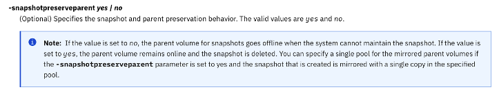
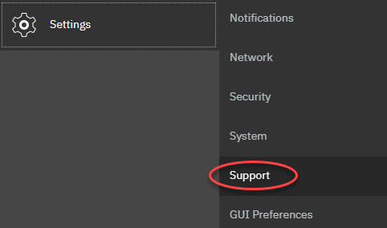
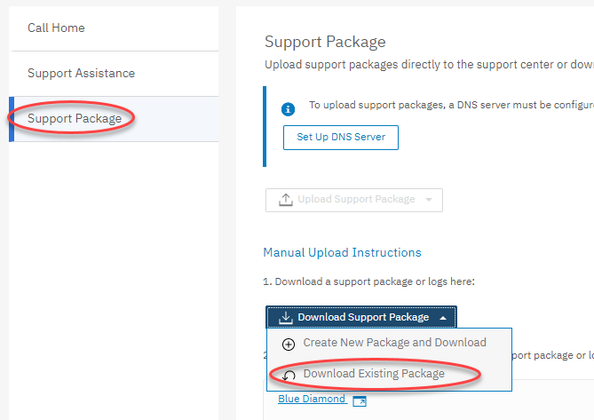
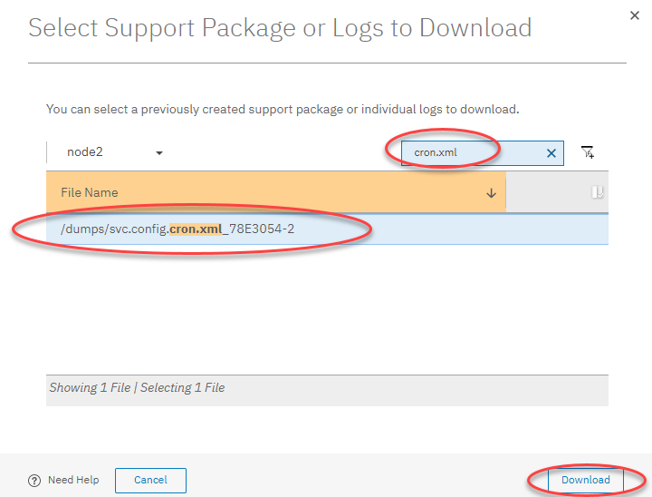

# IBM FlashSystem
## Documentation Links
### Support Information

Find configuration limits and restrictions, release notes, and product documentation for IBM FlashSystem storage.

- [Support Information for FlashSystem 9500](https://www.ibm.com/support/pages/support-information-flashsystem-9500)
- [Support Information for FlashSystem 9200](https://www.ibm.com/support/pages/support-information-flashsystem-9200)
- [Support Information for FlashSystem 7300](https://www.ibm.com/support/pages/support-information-flashsystem-7300)
- [Support Information for FlashSystem 7200](https://www.ibm.com/support/pages/support-information-flashsystem-7200)
- [Support Information for FlashSystem 5000 and 5200](https://www.ibm.com/support/pages/node/6408990)


### Implementation Guide
*A great reference to use during initial implementation of a new FlashSystem*

- [Implementation Guide for IBM Storage Virtualize Version 8.6](https://www.redbooks.ibm.com/redpieces/abstracts/sg248542.html)


### Best Practices Guide
*Use these guides to ensure you are following best practices for zoning, copy services, host connectivity, etc.*

- [Performance and Best Practices Guide for IBM Storage Virtualize 8.6](https://www.redbooks.ibm.com/redpieces/abstracts/sg248543.html)
- [IBM FlashSystem and VMware Implementation and Best Practices Guide](https://www.redbooks.ibm.com/redpieces/abstracts/sg248549.html)


### Microcode Guidance
*If you are upgrading microcode, use this link to determine the latest (LTS) recommended code level along with other levels that are available (non-LTS)*

- [Recommended Code Levels](https://www.ibm.com/support/pages/ibm-storage-virtualize-family-products-upgrade-planning)
- [Supported Drive Types and Firmware Levels](https://www.ibm.com/support/pages/node/873170)
- [Download Microcode from IBM Fix Central](https://www.ibm.com/support/fixcentral)


*This link will show if you are able to upgrade directly to another code level, or if you have to upgrade in two steps.*

- [Concurrent Code Upgrade Paths](https://www.ibm.com/support/pages/node/5692850)


### Other Stuff
- [CSM ESE Sizer](https://www.ibm.com/support/pages/node/6372180)
- [Ansible and IBM Storage](https://www.ansible.com/integrations/infrastructure/ibm-storage)
-	[IBM Storage Ansible Modules](https://galaxy.ansible.com/ibm/spectrum_virtualize)
- [Enable the VMware iSER Adapter](https://docs.vmware.com/en/VMware-vSphere/7.0/com.vmware.vsphere.storage.doc/GUID-4F2C10BB-3705-4040-BFDE-A190FE273060.html)
- [Vdbench Downloads and User Guide](https://www.oracle.com/downloads/server-storage/vdbench-downloads.html)


## Cheat Sheet

- List current date and time

        svqueryclock

- Recover offline volumes (i/o group went offline and lose cache)

        recovervdiskbysystem

- Manually resuming code activation

        lsupdate
        applysoftware -continue

- Restart Web Service

        satask restartservice -service tomcat
        
- IP Replication requires the following firewall ports opened:

    - Cluster IPs: 3260
    - Data IPs: 3265

- Script to Rename Volumes

        lsvdisk -nohdr | grep -v scsi | while read -a line ; do new_name=${line[1]//msc520/bscbak};new_name=${new_name%_01} ; chvdisk -name $new_name ${line[1]}; done

- Script to validate cabling

        lsportfc -nohdr | while read -a port; do printf "%s,port%s," "${port[6]}" "${port[2]}"; lsportfc "${port[0]}" | grep fabric_WWN ; done


## Implementation

### Implementation Checklist
> This is not an official instruction manual from IBM.  Alway refer to the latest IBM docs if you are unsure about how to complete a step in the list below.{.is-info}

The following items are a summary of the most common steps that need to be completed on every implementation.  Some items may not pertain to specific hardware configs (e.g. IP replication), but verifying installs using this list will cover the most critical aspects of a thorough implementation.

- <input type="checkbox"/> Power Up
- <input type="checkbox"/> Configure cluster using the [technician port](https://www.ibm.com/docs/en/flashsystem-7x00/8.4.x?topic=system-initializing-technician-port-ssr-task)
- <input type="checkbox"/> Use a web browser to open: *https://your\_management\_IP*
- <input type="checkbox"/> Log in to the management GUI for the first time by using ID *superuser* and password *passw0rd*.
- <input type="checkbox"/> After you log in, the initial setup wizard helps you get started.  Use the information on your [worksheets](https://www.ibm.com/docs/en/flashsystem-7x00/8.4.x?topic=planning-worksheets) to inform your inputs.
    - <input type="checkbox"/> Welcome
    - <input type="checkbox"/> License Agreement
    - <input type="checkbox"/> Change Password
    - <input type="checkbox"/> System Name
    - <input type="checkbox"/> Licensed Functions
    - <input type="checkbox"/> Date and Time
    - <input type="checkbox"/> Encryption (license required)
    - <input type="checkbox"/> Call Home
    - <input type="checkbox"/> Storage Insights
    - <input type="checkbox"/> Support Assistance
    - <input type="checkbox"/> Automatic Configuration
    - <input type="checkbox"/> Summary
- <input type="checkbox"/> Add additional Control or Expansion Enclosures (if required)
- <input type="checkbox"/> Configure the following:
    - <input type="checkbox"/> [Set the Service IPs](https://www.ibm.com/docs/en/flashsystem-7x00/8.4.x?topic=problem-procedure-changing-service-ip-address-node-canister)
    - <input type="checkbox"/> Ethernet IPs for ISCSI or IP replication
    - <input type="checkbox"/> [Ethernet Portsets](https://www.ibm.com/docs/en/flashsystem-7x00/8.4.x?topic=overview-portsets)
    - <input type="checkbox"/> [Volume Protection](https://www.ibm.com/docs/en/flashsystem-7x00/8.4.x?topic=volumes-volume-protection) (recommend leaving on)
    - <input type="checkbox"/> Call Home / Email Notifications
    - <input type="checkbox"/> SNMP
    - <input type="checkbox"/> Syslog
    - <input type="checkbox"/> LDAP (if desired)
- <input type="checkbox"/> Enable Encryption ([USB](https://www.ibm.com/docs/en/flashsystem-7x00/8.4.x?topic=management-enabling-encryption-usb-flash-drives) or [SKLM](https://www.ibm.com/docs/en/flashsystem-7x00/8.4.x?topic=management-enabling-encryption-key-servers))
- <input type="checkbox"/> Create encrypted pool with data reduction turned off and 1024 extent size (default in GUI)
- <input type="checkbox"/> Add storage to the pool (DRAID6, typically take all defaults in GUI).
- <input type="checkbox"/> Modify I/O Group bitmap space (CLI or now in GUI of newer code)
- <input type="checkbox"/> Modify fibre channel port masking (if needed for replication)
- <input type="checkbox"/> [Update System Software](https://www.ibm.com/docs/en/flashsystem-7x00/8.4.x?topic=updating-system-software)
- <input type="checkbox"/> [Update Drive Firmware](https://www.ibm.com/docs/en/flashsystem-7x00/8.4.x?topic=software-updating-drive-firmware)


### Port Planning
#### Planning for more than four fabric ports per node canister
Last Updated: 2023-06-08

You can use more than four fabric ports per to improve peak load I/O performance, but careful planning is needed.

A *fabric port* is a Fibre Channel port. If you use more than four fabric ports per node, you must either use the **localfcportmask** and **partnerfcportmask** commands or be careful with your fabric zoning configuration.

Careful zoning improves resilience and prevents lease expires due to port errors, low fabric buffer credits, shared adapter resources, or push-back from remote links. Table 1 displays a port allocation scheme.

Table 1. Port allocation scheme  

| Adapter | Port | 4 ports | 8 ports | 12 ports |16 ports | SAN Fabric |
| ------ | ------ | ------ | ------ | ------ | ------ | ------ |
| Adapter 1 Port 1 | Host and Storage	| Host and Storage | Host and Storage | Host and Storage | A |
| Adapter 1 Port 2 | Host and Storage	| Host and Storage | Host and Storage | Host and Storage | B |
| Adapter 1 Port 3 | Intracluster and Replication | Intracluster | Intracluster | Intracluster | A |
| Adapter 1 Port 4 | Intracluster and Replication | Intracluster | Intracluster | Intracluster | B |
| Adapter 2 Port 1 | - | Host and Storage | Host and Storage | Host and Storage | A |
| Adapter 2 Port 2 | - | Host and Storage | Host and Storage | Host and Storage | B |  
| Adapter 2 Port 3 | -	Intracluster or Replication	Replication or Host and Storage	Replication or Host and Storage	A
| Adapter 2 Port 4 | -	Intracluster or Replication	Replication or Host and Storage	Replication or Host and Storage	B
| Adapter 3 Port 1 | -	-	Host and Storage	Host and Storage	A
| Adapter 3 Port 2 | -	-	Host and Storage	Host and Storage	B
| Adapter 3 Port 3 | -	-	Intracluster	Intracluster	A
| Adapter 3 Port 4 | -	-	Intracluster	Intracluster	B
| Adapter 4 Port 1 | -	-	-	Host and Storage	A
| Adapter 4 Port 2 | -	-	-	Host and Storage	B
| Adapter 4 Port 3 | -	-	-	Replication or Host and Storage	A
| Adapter 4 Port 4 | -	-	-	Replication or Host and Storage	B
| localfcportmask	1100	11001100 or 00001100	110000001100	0000110000001100	-
| remotefcportmask	1100	00000000 or 11000000	000011000000	1100000011000000	-
Host refers to host objects defined in the system.
Replication refers to nodes that are part of a different cluster.
Storage refers to controller objects defined in the system if external storage is being used.
Intracluster refers to nodes within the same cluster.
The word "and" indicates that both types are used.
The word "or" indicates that one of the options must be selected. If using replication, preference should be given to replication.
If a receives more than 16 logins from another node, then it causes node error 860.

You can ensure that no more than 16 logins are received by following these guidelines:
Zone the SAN fabric to reduce the number of paths between the nodes.
Apply a local Fibre Channel port mask (if the nodes are within the same system) or partner Fibre Channel port mask (if the nodes are in different systems) to reduce the number of ports that are being used for node-to-node communication.
Provide a combination of the two (zoning and port masks).
To avoid receiving node error 860 and to maximize performance on your system, follow these guidelines:
For redundancy, use a minimum of two ports. If ports are being dedicated for different types of traffic, assign a minimum of two ports for each type of traffic.
Within a system, up to 50% of the overall data that is transferred across the SAN is transmitted between the nodes. However, for read-intensive workloads, the figure is much less. Therefore, if ports are being dedicated for different types of traffic, assign between 1/4 and 1/2 of the overall ports for node-to-node communication within a system.
For replication between systems, the connection between the systems is usually the bottleneck. Other than for redundancy, there is no point in having more SAN connections than there is bandwidth. For example, if two sites are connected with a 10 Gbps link, two 8 Gbps ports are sufficient. Systems usually are configured with two ports per node for replication traffic primarily for redundancy. For systems with larger numbers of nodes, it might be appropriate to have connections only from a subset of the nodes for replication to a remote system. The system automatically forwards replication traffic between local nodes so that all nodes can still participate in replication.

### Safguarded Copy Implementation
#### What if the pools fills up?
There is a system wide setting that is set by using the `chsystem` command that will dictate what happens to safeguarded snapshots and their source volumes when you run out of space in the pool.
You can check your current setting by using the command 
```
lssystem | grep parent
```

There are two options for snapshot behavior if the pool fills up.  

-	Default behavior is that the prod volume will go offline to protect the snapshots (similar to what happened when child pool filled up with the old safeguarded backups).
    ```
    chsystem -snapshotpreserveparent no
    ```
-	Optional behavior is to keep the prod volumes online and have the oldest snapshot deleted:
    ```
    chsystem -snapshotpreserveparent yes
    ```


### Spectrum Virtualize Remote Support IP Addresses


**_Firewall Configuration_**

Any firewall holes that were created to allow connections to the current IP addresses must be updated with the new IP addresses.

|     | Source | Target | Port | Protocol | Direction |
| --- | --- | --- | --- | --- | --- |
| Existing Remote Support Servers<br><br>*These firewall holes can be removed once new servers are configured and running* | The service IP address of every node or node canister | 129.33.206.139 204.146.30.139 | 22  | ssh | Outbound only |
| New Remote Support Servers | The service IP address of every node or node canister | 170.225.126.11<br><br>170.225.126.12<br><br>170.225.127.11<br><br>170.225.127.12 | 22  | ssh | Outbound only |

#### IP address details
The new IP addresses for remote support are:

-   170.225.126.11 - xrsc-front-srv-1.southdata.ibm.com
-   170.225.126.12 - xrsc-front-srv-2.southdata.ibm.com
-   170.225.127.11 - xrsc-front-srv-3.eastdata.ibm.com
-   170.225.127.12 - xrsc-front-srv-4.eastdata.ibm.com
#### Fix Central Code Download - Firewall Configuration
IBM Announced in [https://www.ibm.com/support/pages/node/6573219](https://www.ibm.com/support/pages/node/6573219) that there would be a number of changes to some central support infrastructure. 

!!! info

    - Direct connection to Fix Central on port 22 was deprecated in V8.4.2.  Systems running V8.4.2 or higher download code via esupport.ibm.com on port 443.
    - The Fix Central DNS names were updated to point to the new IP addresses on 4 June 2022.  Storage Virtualize devices use DNS to connect to Fix Central, therefore all connections will automatically be connecting to the new IP addresses.


|     | Source | Target | Port | Protocol | Direction |
| --- | --- | --- | --- | --- | --- |
| New Fix Central IP addresses | The service IP address of every node or node canister | 170.225.126.44 | 22  | sftp | Outbound only |

**_Additional IBM Support IP address changes that do not affect Storage Virtualize products._**

The following notification was sent out relating to additional IP address changes.  These changes do not affect Storage Virtualize products

[https://www.ibm.com/support/pages/node/6587781](https://www.ibm.com/support/pages/node/6587781)

  
 

## Support Procedures

### Export Config XML File
1. Log into the GUI
1. In the left menu, select Settings → Support

1. Select Support Package and click on the Download Support Package option and choose Download Existing Package

1. In the filter on the top right, enter `cron.xml` and hit enter.  Select the file, and click Download

1. The file will be downloaded by your browser (typically to your Download folder).

## Wiping a System to Return/Resell


### Erase All Drives
1. Delete all volumes and pools
1. Ensure all drives are in _candidate_ use state

        lsdrive

1. Erase all drives using this script

        lsdrive -nohdr | while read -a line ; do chdrive -task erase ${line[0]} ; done

1. Verify erasure completion

        lsdriveprogress


### Reset System to Factory Defaults
1. Delete all hosts, volumes, and pools
1. As superuser, ssh into the service IP node 1 and issue the following:

        sainfo lsservicenodes
        satask startservice -force <node2_panel_name>
        satask startservice -force <node1_panel_name>

1. Log back into node 1 service IP and issue the following  (ensure both nodes are in service):

        sainfo lsservicenodes 
        satask leavecluster -force <node2_panel_name>
        satask leavecluster -force <node1_panel_name>

!!! note 

    The previous steps will reset the superuser password back to factory defaults.  Use **passw0rd** as the password going forward


1. Log back into node 1 service IP and issue the following (ensure ‘cluster_id’, ‘cluster_name’, ‘node_name’ are blank):

        sainfo lsservicenodes 
        satask chvpd -resetclusterid <node2_panel_name>
        satask chvpd -resetclusterid <node1_panel_name>

1. Reboot the nodes:

        satask stopnode -reboot <node2_panel_name>
        satask stopnode -reboot <node1_panel_name>

1. Log back into node 1 service IP and issue the following (both nodes should show 'node_status' as _Candidate_ ):

        sainfo lsservicenodes 


## Scripts
### Determine Remote Copy Status
#### Objective
This script will list the progress of all remote copy relationships defined on the system.  It will output the source volume name followed by the “progress” percentage. 

!!! note

    This is based on the OLD remote copy technology.  This should not be used for Policy Based Replication


#### Script Syntax

```typescript
lsrcrelationship -nohdr | while read -a relationship
do echo "Volume Name:  "${relationship[5]}
lsrcrelationship ${relationship[0]}|grep progress
echo
done
```

#### Example output:

```plaintext
Volume Name:  Thor_0
progress 99	

Volume Name:  Thor_1
progress 99

Volume Name:  Thor_2
progress 99

Volume Name:  Thor_3
progress 99

Volume Name:  Thor_4
progress 99

Volume Name:  Thor_5
progress 99

Volume Name:  Thor_IASP1_0
progress 99

Volume Name:  Thor_IASP1_1
progress 99

Volume Name:  Thor_IASP1_2
progress 99

Volume Name:  Thor_IASP1_3
progress 99

Volume Name:  Thor_IASP1_4
progress 100
```

### Validate Fibre Channel Host Connectivity Script 
#### Objective
This script will display all of the SAN fabric connectivity for each defined Host and indicate what port the host is connected through.

#### Script Syntax

```typescript
svcinfo lshost -nohdr|while read -a host
do
  printf "\n%-20s\n" ${host[1]}
  svcinfo lsnode -nohdr |while read -a node
  do
  printf "\nnode %s " ${node[1]}
    for port in 1 2 3 4
    do
      printf "-"
      svcinfo lsfabric -nohdr -host ${host[1]} |while read -a fabric
      do
        [[ ${fabric[2]} == ${node[0]} && ${fabric[5]} == $port ]] && printf "\b\033[01;3%dm$port\033[0m" $((${#fabric[7]}/2-1))
      done
    done
  done
  printf "\n"
done
```

#### Example output:

```plaintext
esx20               

node node1 12--
node node2 12--

esx21               

node node1 12--
node node2 12--

esx22               

node node1 12--
node node2 12--

esx23               

node node1 12--
node node2 12--

esx24               

node node1 12--
node node2 12--

rick-w2019          

node node1 --3-
node node2 --3-

esx11               

node node1 12--
node node2 12--

test                

node node1 -2--
node node2 -2--
```

